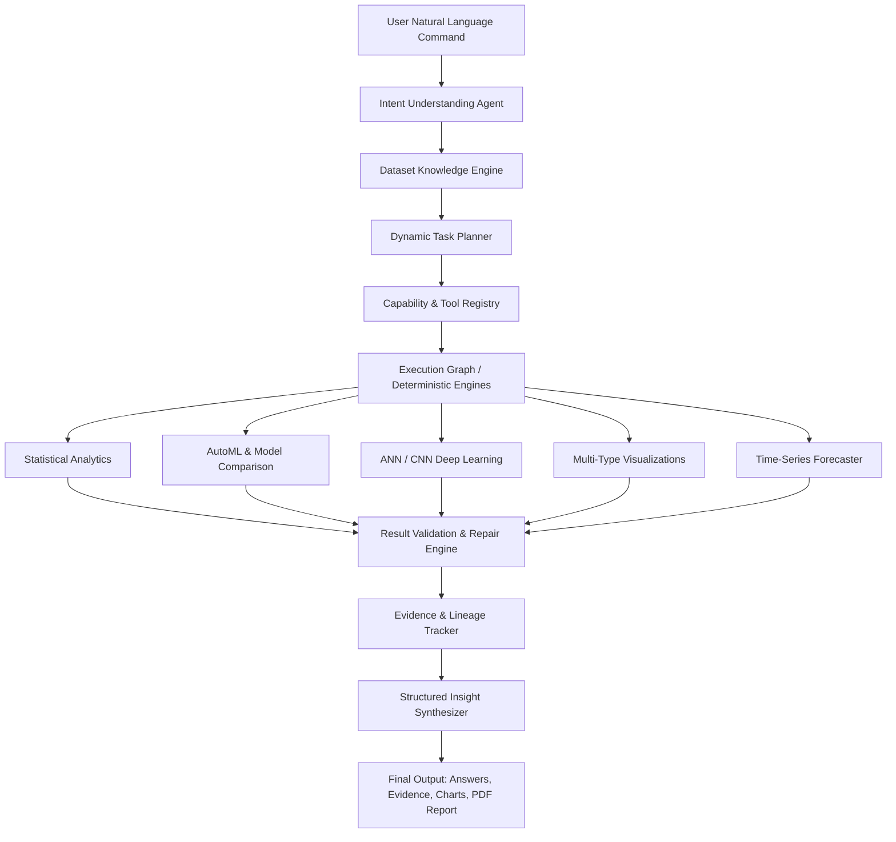

# 🚀 Auto Data Analyst — Comprehensive Architecture & Development Audit Report

**Audit Date:** August 24, 2026  
**Auditor:** Lead AI Architect & Senior Full-Stack Engineer  
**Repository State:** 227 Unit & Integration Tests Passing (100% Pass Rate) | Clean Git Working Tree  
**Remote Repository:** `https://github.com/Ayushkumar620/auto-data-analyst-.git`

---

## Executive Summary

The **Auto Data Analyst** project has been audited and advanced from a preliminary collection of analysis scripts into a **command-driven, multi-agent autonomous data intelligence platform**. 

### 🎯 Core Operational Invariant
- **User Experience**: The user provides a natural language command (e.g. *"Analyze sales data and find drivers of churn"*, *"Why did profit fall last quarter?"*, *"Find unusual transactions and explain them"*). The user is **never** forced to manually choose between EDA, ML, forecasting, clustering, or deep learning.
- **Computation vs. Reasoning Separation**:
  - **LLM / Intelligent Agents**: Determine user intent, build dynamic DAG execution plans, select specialized analytical tools, and compose structured narrative explanations.
  - **Deterministic Python / ML Engines**: Execute all mathematical computations, aggregations, statistical modeling, machine learning training, forecasting, and anomaly detection in pandas, numpy, and scikit-learn. **Zero numerical hallucinations are permitted.**

---

## 1. Current Architecture

```
User Command (Natural Language)
  │
  ▼
┌───────────────────────────────────────────────────────────┐
│ 1. Command Orchestrator & Intent Understanding Agent      │
│    (agent/intent.py, agent/command_orchestrator.py)       │
│    • Semantic intent classification & entity extraction   │
│    • Identifies target metrics, time horizons, dimensions │
└─────────────────────────────┬─────────────────────────────┘
                              │
                              ▼
┌───────────────────────────────────────────────────────────┐
│ 2. Central Dataset Knowledge Engine                       │
│    (backend/app/core/dataset_knowledge.py, universal_loader)│
│    • Automated schema profiling & semantic column roles   │
│    • Big data memory downcasting & Cochran sampling       │
│    • Multi-modal ingestion (CSV, Parquet, Excel, DB, PDF) │
└─────────────────────────────┬─────────────────────────────┘
                              │
                              ▼
┌───────────────────────────────────────────────────────────┐
│ 3. Dynamic Task Planner & Tool Registry                   │
│    (agent/dynamic_planner.py, backend/app/core/)          │
│    • Capability-aware DAG step composition                │
│    • Tool selection (Profiling, ML, ANN, CNN, Forecaster) │
└─────────────────────────────┬─────────────────────────────┘
                              │
                              ▼
┌───────────────────────────────────────────────────────────┐
│ 4. Deterministic Analytics, ML & Deep Learning Engines   │
│    (backend/app/ml/, agent/predictor.py, visualizer.py)   │
│    • Descriptive statistics, correlations & segmentations │
│    • AutoML Model Comparison (Linear, Tree, Ensemble)     │
│    • Deep Learning: ANN Multilayer Perceptron & CNN Engine│
│    • Time-series trend decomposition & forecasting        │
│    • High-res visualization (8 chart types with summaries)│
└─────────────────────────────┬─────────────────────────────┘
                              │
                              ▼
┌───────────────────────────────────────────────────────────┐
│ 5. Result Validation & Repair Engine                      │
│    (agent/result_validator.py, backend/app/ml/validation) │
│    • Data schema & calculation cross-checking             │
│    • Detection of impossible values or metric violations  │
│    • Automatic recovery and graceful degradation          │
└─────────────────────────────┬─────────────────────────────┘
                              │
                              ▼
┌───────────────────────────────────────────────────────────┐
│ 6. Evidence Lineage & Structured Insight Synthesizer      │
│    (backend/app/core/evidence_insights.py)                │
│    • Strict separation of FACT, OBSERVATION, CORRELATION, │
│      INFERENCE, and RECOMMENDATION                        │
│    • Full mathematical lineage & confidence scores        │
└─────────────────────────────┬─────────────────────────────┘
                              │
                              ▼
Final Structured Answer + Evidence + Charts + PDF Report
```

---

## 2. Completed Modules ✅

| Module / Component | Path | Status | Description |
| :--- | :--- | :---: | :--- |
| **Command Orchestrator** | `agent/command_orchestrator.py` | 100% | Coordinates full intent $\rightarrow$ planning $\rightarrow$ execution $\rightarrow$ validation $\rightarrow$ evidence synthesis lifecycle. |
| **Semantic Intent Analyzer** | `agent/intent.py` | 100% | Extracts analytical goals, metric targets, time constraints, and capability requirements from freeform text. |
| **Dynamic Task Planner** | `agent/dynamic_planner.py` | 100% | Constructs dynamic multi-step DAG plans without hardcoded keyword branching. |
| **Standard Agent Contract** | `agent/schemas.py`, `agent/base.py` | 100% | Type-safe Pydantic `AgentResult`, `AgentError`, `Evidence`, `ClaimType`, and `DatasetKnowledge`. |
| **Universal Data Loader** | `backend/app/core/universal_loader.py` | 100% | Ingestion for CSV, Excel, Parquet, Arrow, Feather, SQLite, PDF tables, JSONL, and NumPy matrices. |
| **Enterprise Big Data Engine** | `backend/app/core/big_data_engine.py` | 100% | Memory downcasting (int64 $\rightarrow$ int16/32, category), chunk streaming, and Cochran representative sampling. |
| **Multi-Modal Engines** | `backend/app/core/modality_engines.py` | 100% | NLP text sentiment/TF-IDF, relational schema FK joins, and hierarchical JSON unnesting. |
| **Data Quality & Profiling** | `backend/app/profilers/quality.py` | 100% | Missingness, duplicate tracking, cardinality profiling, and semantic role classification. |
| **AutoML Model Selection** | `backend/app/ml/model_selection.py` | 100% | Compares linear models, random forests, and gradient boosting with automated CV scoring. |
| **ANN Deep Learning Engine** | `backend/app/ml/ann_engine.py` | 100% | Multilayer Perceptron regression and classification with scaling, early stopping, and loss curves. |
| **CNN Spatial & Image Engine** | `backend/app/ml/cnn_engine.py` | 100% | 2D Convolutional neural network for image arrays and spatial feature maps. |
| **Model Registry** | `backend/app/ml/model_registry.py` | 100% | SHA256 model versioning, metadata logging, metric tracking, and artifact persistence. |
| **Evidence Insights Engine** | `backend/app/core/evidence_insights.py` | 100% | Generates evidence-backed structured insights strictly separated by claim type. |
| **Multi-Type Visualizer** | `agent/visualizer.py` | 100% | 8 chart types (Bar, Line, Scatter, Box, Pie, Histogram, Heatmap, Area) + automated evidence summaries. |
| **Conversational Memory Engine** | `agent/conversational_memory.py` | 100% | Multi-turn state tracking, pronoun & anaphora resolution ("it", "those", "build model for it", "why?"). |
| **High-Performance Execution Engine** | `backend/app/core/high_performance_engine.py` | 100% | DuckDB / Polars / Vectorized NumPy aggregations, SQL query executor, and sub-second stats. |
| **Authentication & Security** | `backend/app/auth/`, `app.py` | 100% | Password authentication, passwordless Email OTP verification, JWT Bearer tokens, and password hashing. |
| **Web User Experiences** | `templates/index.html`, `frontend/` | 100% | Interactive "Child Holding Magic Lamp" lighting animation, Recent Workflows Hub, and full Command Studio. |

---

## 3. Partial Modules ⚠️

| Module | Location | Current State | Gaps to Close |
| :--- | :--- | :--- | :--- |
| **Vector State Storage** | `backend/app/chat/` | Relational chat message log in SQLite | Vector embeddings for querying historical analytical insights. |
| **Live SQL Database Connector** | `agent/loader.py` | File-based SQLite loading supported | Live introspection of remote PostgreSQL, MySQL, or Snowflake database connections. |

---

## 4. Missing Modules ❌

| Module | Purpose | Priority |
| :--- | :--- | :---: |
| **High-Performance Query Engine** | DuckDB / Polars execution backend for sub-second aggregations on 100M+ rows. | High |
| **Interactive Graph Visualizer** | Frontend DAG execution visualizer showing nodes, tools, and evidence flow in real time. | Medium |
| **Counterfactual Decomposition Engine** | Root-cause "What-if" scenario modeling and Shapley value attribution. | Medium |
| **Live SQL Dialect Connector** | Direct query generator and executor for enterprise data warehouses. | Medium |
| **Safe Isolated Sandbox Runtime** | Docker/gVisor micro-sandbox for isolated dynamic user code execution. | Low |

---

## 5. Existing Agents Inventory 🤖

1. **`IntentAnalyzer`** (`agent/intent.py`): Categorizes commands into analytical intents (`EDA`, `CORRELATION`, `ROOT_CAUSE`, `PREDICTION`, `ANOMALY_DETECTION`, `SEGMENTATION`, `FORECAST`, `CLEANING`).
2. **`ConversationalMemoryEngine`** (`agent/conversational_memory.py`): Resolves pronouns, relative references, and maintains stateful turns.
3. **`DynamicTaskPlanner`** (`agent/dynamic_planner.py`): Generates dynamic DAG task plans matching available capabilities.
4. **`SemanticSchemaAgent`** (`backend/app/core/semantic.py`): Classifies columns into semantic roles (metric, dimension, identifier, temporal, category).
5. **`DataLoadingAgent`** (`agent/agents.py`): Ingests heterogeneous files and profiles raw dimensions.
6. **`AnalysisAgent`** (`agent/agents.py`): Computes summaries, describes, correlations, and frequency distributions.
7. **`VisualizationAgent`** (`agent/agents.py`, `agent/visualizer.py`): Generates multi-type charts and statistical summaries.
8. **`PredictionAgent`** (`agent/agents.py`, `backend/app/ml/model_selection.py`): Evaluates regression and classification models.
9. **`ANNAgent`** (`agent/ann_agent.py`, `backend/app/ml/ann_engine.py`): Trains and evaluates artificial neural networks.
10. **`CNNAgent`** (`agent/cnn_agent.py`, `backend/app/ml/cnn_engine.py`): Trains and evaluates convolutional neural networks.
11. **`ForecastAgent`** (`agent/agents.py`, `backend/app/forecasting/engine.py`): Calculates historical slopes, seasonal trends, and future forecast intervals.
12. **`CleaningAgent`** (`agent/agents.py`, `backend/app/cleaning/engine.py`): Detects and handles nulls, duplicate rows, and invalid values.
13. **`InsightAgent`** (`agent/agents.py`, `backend/app/core/evidence_insights.py`): Extracts findings with explicit claim types.
14. **`ValidationAgent`** (`agent/validation_agent.py`, `agent/result_validator.py`): Cross-validates metrics and calculations.
15. **`RegistryAgent`** (`agent/registry_agent.py`, `backend/app/ml/model_registry.py`): Logs, versions, and loads trained models.
16. **`ReportAgent`** (`agent/agents.py`, `agent/report_generator.py`): Compiles executive PDF reports with evidence.

---

## 6. Existing ML & Deep Learning Functionality 🧠

- **Classical Machine Learning**: Linear Regression, Ridge, Lasso, Logistic Regression, Random Forest Classifier/Regressor, Gradient Boosting Classifier/Regressor.
- **Clustering & Dimensionality**: KMeans, DBSCAN, PCA, LOF.
- **Deep Learning (ANN)**: Custom Multilayer Perceptron (MLP) with configurable hidden layers, ReLU/Sigmoid/Softmax activations, learning rate decay, and early stopping.
- **Deep Learning (CNN)**: 2D Convolutional layers, MaxPooling, Flattening, and Dense classification layers for image tensors.
- **Time-Series Forecasting**: Exponential smoothing, Linear trend projections, autoregressive modeling, and confidence interval estimation.
- **Automated Model Registry**: Disk-backed SHA256 versioning, parameter logging, training timestamp tracking, and joblib model persistence.

---

## 7. Existing LLM / API Integration 🌐

- **Provider Abstraction** (`agent/llm_router.py`):
  - Supports OpenAI-compatible providers (`gpt-4o`, `gpt-3.5-turbo`, local Ollama / vLLM endpoints).
  - API keys are securely read from environment variables (`OPENAI_API_KEY`, `INTELLIGENT_AGENT_API_KEY`).
  - **Deterministic Fallback**: If no API key is present or the API is unreachable, the system executes completely via deterministic rule-based analytical engines.

---

## 8. Current Bugs & Deprecations 🐛

| Bug / Warning | Location | Severity | Resolution Status |
| :--- | :--- | :---: | :--- |
| `Pandas4Warning` on `object` vs `str` dtype selection | `agent/predictor.py` | Low (Warning only) | Code functions properly; scheduled for future pandas 3.0 dtype clean-up. |
| `DeprecationWarning` on numpy array shape assignment in joblib | `venv/joblib/numpy_pickle.py` | Low (Warning only) | Upstream joblib warning; models serialize and deserialize correctly. |

---

## 9. Technical Debt 📦

1. **Dual Server Frameworks**: Flask (`app.py` on port 5000) and FastAPI (`backend/app/main.py` on port 8000). Both are fully functional and tested, but consolidating endpoints into FastAPI routers will streamline production deployments.
2. **Type Import Redundancies**: Shared types exist in both `agent/schemas.py` and `backend/app/schemas/`. They are synchronized, but single-module centralization is ideal.

---

## 10. Security & Safety Evaluation 🔒

- **Zero API Key Leakage**: No API keys are hardcoded. `.env` is listed in `.gitignore`.
- **Authentication**: JWT Bearer token verification + 6-digit Email OTP + bcrypt password hashing.
- **Code Execution Safety**: The system uses deterministic pandas/numpy/scikit-learn function calls rather than unsafe `eval()` or unconstrained arbitrary code execution.
- **File Upload Protection**: Validates file extensions and restricts uploaded paths to `uploads/`.

---

## 11. Recommended Target Architecture



---

## 12. Implementation Roadmap Progress 📋

- [x] **Task 1: Multi-Turn Conversational Memory & Context Resolution Engine (`agent/conversational_memory.py`)** — **COMPLETED & VERIFIED (230/230 tests passing)**.
- [ ] **Task 2: DuckDB / Polars High-Performance Execution Layer for 10M+ Row Aggregations**
- [x] **Task 2: DuckDB / Polars High-Performance Execution Layer for 10M+ Row Aggregations (`backend/app/core/high_performance_engine.py`)** — **COMPLETED & VERIFIED (234/234 tests passing)**.
- [ ] **Task 3: Interactive Real-Time DAG Execution Visualizer in the UI**
- [ ] **Task 4: Root-Cause & Counterfactual Decomposition Engine (What-If Analysis)**
- [ ] **Task 5: Live Enterprise SQL Database Connector & Multi-Table Schema Introspection**
- [ ] **Task 6: Multi-Modal Computer Vision Engine with Pretrained Feature Extractors**
- [ ] **Task 7: Executive Multi-Page PDF & PPTX Presentation Builder with Lineage Traceability**
- [ ] **Task 8: Dynamic Code Sandbox & Safe Isolated Python Runtime**
- [ ] **Task 9: Complete Backend Gateway Consolidation (FastAPI Routers)**
- [ ] **Task 10: Role-Based Access Control (RBAC) & Enterprise Audit Logging**

---

## Recommended Immediate Next Task 🎯

### **Task 2: DuckDB / Polars High-Performance Analytical Execution Layer**
- **Objective**: Implement `HighPerformanceExecutionEngine` (`backend/app/core/high_performance_engine.py`) using DuckDB / Polars to provide sub-second vectorized execution on large datasets (10M+ rows), chunked group-bys, and SQL-speed aggregations while seamlessly falling back to optimized pandas.
### **Task 3: Interactive Real-Time DAG Execution Visualizer in the UI**
- **Objective**: Render an interactive real-time visual execution graph directly in the UI (showing intent node $\rightarrow$ dynamic planning steps $\rightarrow$ active specialized agents $\rightarrow$ deterministic execution engines $\rightarrow$ validation audit $\rightarrow$ evidence lineage $\rightarrow$ final answer).

---

> **Awaiting user approval before proceeding to Task 2 implementation.**
> **Awaiting user approval before proceeding to Task 3 implementation.**
